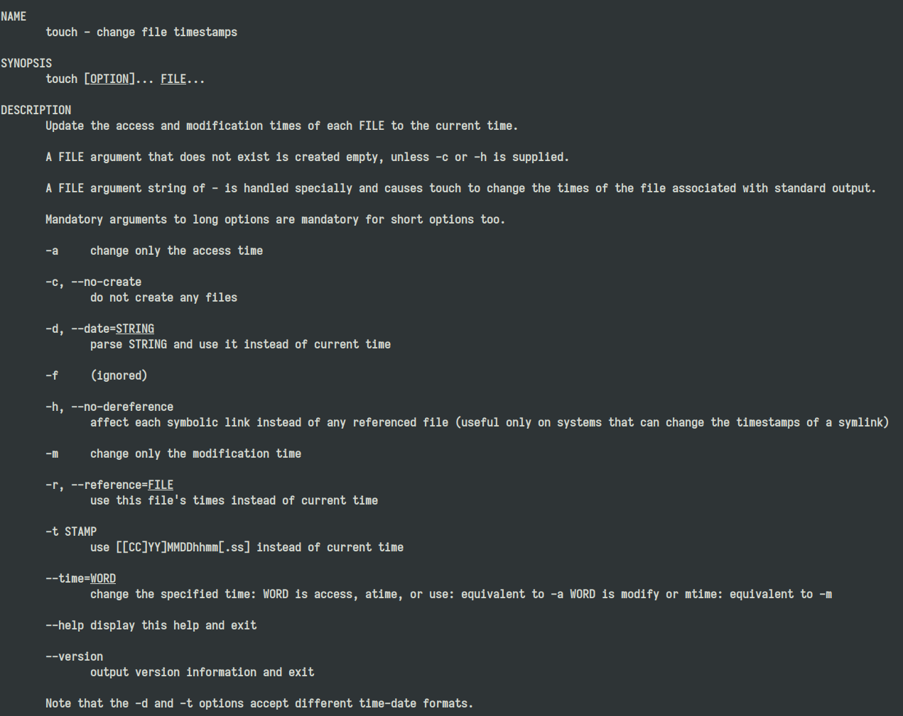

應用程式開發介面(**API**)定義了與其他軟體系統通訊時必須遵循的規則。開發人員公開或建立 API，以便其他應用程式能夠以程式設計方式與其應用程式通訊。例如，時間表應用程式公開一個 API，要求提供員工的全名和日期範圍。收到此資訊後，它會在內部處理員工的時間表，並傳回該日期範圍內的工作時數。

其重點在於「介面」，意義是兩個事物之間如何互動的。舉一個現實世界中的例子，ATM的介面：一個螢幕和幾個按鈕，允許客戶與他們的銀行互動並請求服務，例如取出現金。同樣，API 是一個軟體與另一個程式互動以獲得所需服務的方式。

API 主要目的是讓應用程式開發人員得以呼叫一組常式功能，而無須考慮其底層的原始碼為何、或理解其內部工作機制的細節。API本身是抽象的，它僅定義了一個介面，而不涉及應用程式在實作過程中的具體操作。

## 各種各樣的 API

由於 API 的本質是「對外暴露能力的協約」，但具體形式會依照系統層級與通訊方式不同而有所差異。常見可分為幾個類別

- 程式語言 API
- 作業系統 API
- RESTful API

### 語言級別的 API

函式庫會公開一組函式、類別或模組，讓其他程式呼叫。呼叫者只需要遵守函式簽名（function signature）與輸入輸出規則，不需要了解內部實作。

```cpp
std::vector<int> v;
v.push_back(114514);
```

`push_back` 就是一個 API，表現為一種函式或方法

### 作業系統 API

作業系統提供系統呼叫（system call）讓程式存取系統資源，例如：

- 檔案
- 記憶體
- 網路
- 行程

由作業系統提供 API，最終會轉換成 kernel system call。可以表現成函式庫的形式：

```c
int fd = open("file.txt", O_RDONLY);
read(fd, buffer, BUF_SIZE);
```

同樣的，也可以使用 `shell` 進行 system call：

```shell
touch filename
```

這個指令其實就是在呼叫 `touch` 程式暴露的介面。

### RESTful API

Web API 是目前最常見的一種 API。

API 透過 HTTP 協定暴露 endpoint，其他程式可以透過網路請求呼叫。

```http
GET /users/42
```

收到

```json
{
  "id": 42,
  "name": "Alice"
}
```

透過 **HTTP/HTTPS**，基於網際網路協定(Protocol)而非程式語言。

在未來的章節，會詳細說明 RESTFul API 的概念，這是本門課程的核心。

## API 的形式

為什麼 API 的重點是「介面」呢？前面的例子中，使用了 `touch` 作為範例，考慮一下 `touch` 主要的功能：將每個文件的存取時間和修改時間更新為目前時間。



```bash
touch [OPTION]... FILE...
```

---

如果嘗試把 `touch` 做成 C 語言的函式：

```c
int touch(
    const char *path,
    int change_atime,
    int change_mtime,
    int no_create,
    const struct timespec *time,
    const char *reference_file
);
```

| 參數           | 對應 OPTION | 說明                     |
| -------------- | ----------- | ------------------------ |
| path           | FILE        | 目標檔案                 |
| change_atime   | `-a`        | 只更新 access time       |
| change_mtime   | `-m`        | 只更新 modification time |
| no_create      | `-c`        | 不建立檔案               |
| time           | `-d` / `-t` | 指定時間                 |
| reference_file | `-r`        | 參考另一個檔案的時間     |

```c
// touch file.txt
touch("file.txt", 1, 1, 0, NULL, NULL);

// touch -c file.txt
touch("file.txt", 1, 1, 1, NULL, NULL);

// touch -r ref.txt file.txt
touch("file.txt", 1, 1, 0, NULL, "ref.txt");
```

---

如果嘗試把 `touch` 做成 RESTFul API 的形式：

```http
PATCH /files/{path}/timestamps
```

```json
{
  "access_time": "2026-01-01T10:00:00Z",
  "modification_time": "2026-01-01T10:00:00Z",
  "create_if_missing": true,
  "reference_file": null
}
```

| 欄位              | 對應 OPTION | 說明              |
| ----------------- | ----------- | ----------------- |
| access_time       | `-a`        | access time       |
| modification_time | `-m`        | modification time |
| create_if_missing | `-c`        | 是否建立檔案      |
| reference_file    | `-r`        | 參考檔案          |

---

| 行為       | CLI             | C API            | REST API                         |
| ---------- | --------------- | ---------------- | -------------------------------- |
| 更新時間   | `touch file`    | `touch(path)`    | `PATCH /files/{path}/timestamps` |
| 不建立檔案 | `touch -c file` | `no_create=1`    | `"create_if_missing": false`     |
| 指定時間   | `touch -t`      | `timespec`       | `"modification_time"`            |
| 參考檔案   | `touch -r`      | `reference_file` | `"reference_file"`               |
